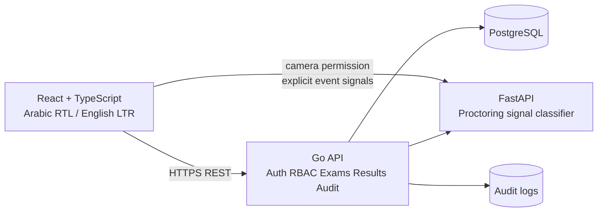

# Architecture

HNU TEST is a modular monorepo. The browser client is a React/TypeScript SPA, the primary API is a Go service, PostgreSQL is the system of record, and the Python service performs privacy-conscious event classification from explicit signals rather than declaring that a student cheated.

The first slice prioritizes secure boundaries and working vertical paths. A full production rollout should add a managed secret store, a distributed queue for notifications and grading jobs, Redis for shared rate limits, object storage only when approved retention policies require evidence files, and an observability stack.

## Boundaries

The Go service owns authentication, authorization, lifecycle state, database transactions, server-side time and scoring. The frontend never determines the final grade or deadline. The Python service returns a structured suspicious-event candidate containing event type, confidence, timestamp, and evidence metadata. A human proctor remains responsible for review and escalation.
