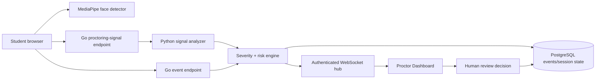

# Real-Time Proctoring

Phase 3 now provides a real-time, human-in-the-loop monitoring path without storing raw webcam video. The student browser requests camera permission, shows a local preview, loads MediaPipe Face Detector in the browser, and sends only derived metadata such as face count, camera state, fullscreen state, tab visibility and network state.

## Runtime flow

The Python service classifies `face_missing`, `multiple_faces`, `camera_interrupted`, `fullscreen_exited`, `tab_visibility_changed`, `network_offline`, `network_degraded`, `window_blurred` and `face_position_changed`. The Go service applies a deterministic severity and risk score, persists the event, updates the live session risk, and broadcasts the event to authorized dashboard clients.

## API and realtime surface

| Surface | Purpose |
|---|---|
| `POST /api/v1/attempts/{id}/proctoring-signal` | Sends a derived browser signal through Python analysis and persists suspicious output |
| `POST /api/v1/attempts/{id}/proctoring-events` | Persists a browser lifecycle event such as tab, fullscreen, network or camera state |
| `GET /api/v1/proctoring/active-attempts` | Returns active sessions, risk score, face count, open event count and connection status |
| `GET /api/v1/proctoring/attempts/{id}/events` | Returns recent events for a review session |
| `POST /api/v1/proctoring/events/{eventId}/review` | Records `confirmed`, `dismissed` or `needs_followup` with a reviewer note |
| `GET /api/v1/proctoring/ws?token=...` | Authenticated WebSocket feed for proctors, instructors and administrators |

WebSocket messages are JSON objects with `type`, `attemptId` and `data`. The server sends `proctoring.ready` on connection and `proctoring.event` when an analyzed or browser event is persisted. The browser query token is accepted only for this WebSocket route because browsers cannot set a custom Authorization header during the initial WebSocket handshake; the origin is checked against `CORS_ORIGINS`.

## Privacy and safety boundaries

The system deliberately does not upload raw video, does not make a cheating determination, and does not automatically punish a student. A risk score is an operational prioritization signal, not a verdict. Review status and reviewer notes are persisted for an appealable human decision. A production deployment still requires a privacy impact assessment, explicit student notice, a retention schedule, role-scoped review access, encryption in transit, and a documented appeal process.

The browser uses external MediaPipe WASM/model URLs in this phase. Production deployment should pin and self-host those assets, add a Content Security Policy for the chosen asset origin, and verify model provenance. Camera, face detection, tab, fullscreen and network signals are not equivalent to identity verification; this phase is therefore **COMPLETE for the realtime event/review path** and **PARTIAL for production-grade identity assurance**.
